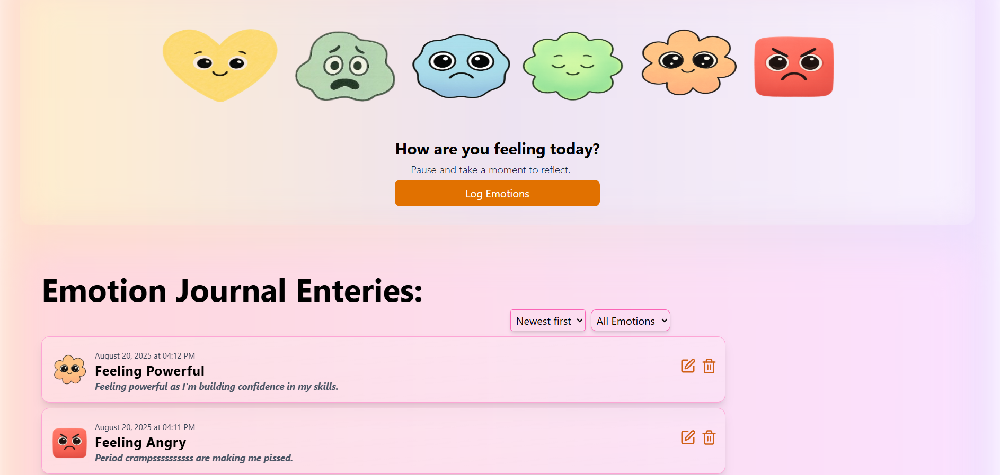

🌸 Mood Board

A React practice project where you can log your thoughts and emotions, manage them with edit / delete, and explore them with filtering and sorting features. Entries are stored in localStorage (keyed by date) so your data persists across sessions.

✨ Features

🎭 Log your mood — select an emotion and add a thought.

✏️ Edit & Delete — update or remove saved entries anytime.

🎨 Emotion Icons — each entry is paired with an emoji-like icon.

📅 Sort by Date — view your entries in chronological order.

🔍 Filter by Emotion — focus only on specific moods (e.g., Sad, Joyful).

💾 LocalStorage Persistence — saves data in browser storage (grouped by date).

🖼 Glassmorphism UI — clean, pastel-inspired interface with Tailwind CSS.

🛠️ Tech Stack

React ⚛️

Tailwind CSS 🎨

Lucide Icons ✨

LocalStorage for persistence

🚀 Getting Started
1️⃣ Clone the repo
git clone https://github.com/your-username/mood-board.git
cd mood-board

2️⃣ Install dependencies
npm install

3️⃣ Start the development server
npm run dev

App will be available at:
👉 http://localhost:5173 (if using Vite)

🔑 Core Logic

State Management — uses React useState + useEffect hooks

Persistence — thoughts stored in localStorage like:

{
  "2025-08-19": [
    {
      "emotion": "Joyful",
      "thought": "Had a great coffee today ☕",
      "createdAt": "2025-08-19T14:32:00.000Z"
    }
  ]
}

Sorting — newest first or oldest first (custom comparator).

Filtering — dropdown for emotions.

UI Layout — flexbox & grid with Tailwind.

🎯 Future Improvements

📊 Analytics (track mood frequency)

🌈 Theme toggle (dark/light mode)

📱 Mobile-friendly optimizations

☁️ Cloud sync (instead of only localStorage)

📸 Screenshots

(Add screenshots or GIFs of your app here)

🤝 Contributing

This is a practice project, but feel free to fork, improve, and submit PRs!